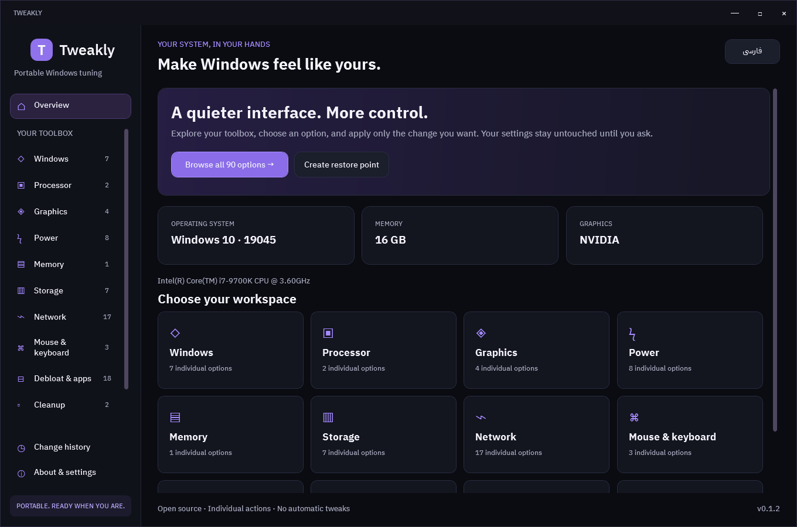
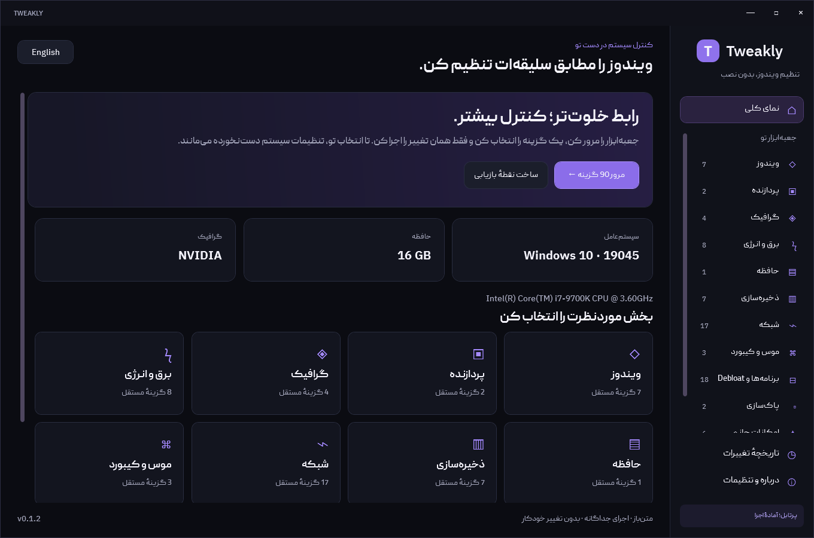
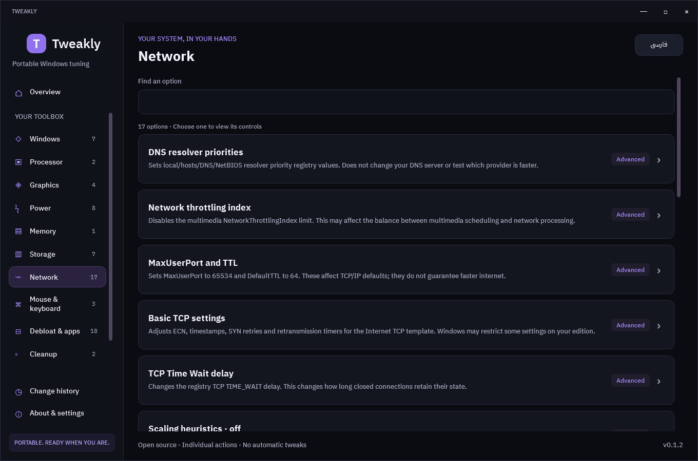

<div align="center">

# Tweakly

**Your Windows settings. Your choice. One option at a time.**

A portable, open-source Windows tuning app with a bilingual English / Persian interface.

[](https://github.com/74hamed/Tweakly/actions/workflows/build.yml)
[](https://dotnet.microsoft.com/en-us/download/dotnet/10.0)
[](#requirements)
[](#verification)
[](LICENSE)

**[Download EXE](https://github.com/74hamed/Tweakly/releases/latest) · [Screenshots](#screenshots) · [Build from source](#build-from-source) · [فارسی](#فارسی)**

</div>



> [!WARNING]
> **Early stage software.** Tweakly has had limited practical testing. Its automated checks cover execution and restoration logic; they do not prove that every option works on every Windows or driver configuration. Use a disposable test machine for advanced changes and keep an independent backup of important data.

## What is Tweakly?

Tweakly puts individual Windows settings in a clean desktop interface. Open one EXE, choose a category, read an option's effect, and apply that option when you are ready. Launching the app only reads system information; it does not apply tweaks automatically.

“One click” means launching a portable app. Each setting remains a separate choice.

## Highlights

| Feature | What you get |
| --- | --- |
| **Portable EXE** | No installer or separate .NET runtime installation required. |
| **90 individual options** | Windows, CPU, GPU, power, memory, storage, network, input, debloat, cleanup, extras and recovery. |
| **English & Persian** | LTR / RTL layouts, embedded IBM Plex Sans / Peyda fonts and readable option cards. |
| **Informed changes** | Effect descriptions, current-state inspection and explicit reasons for unavailable options. |
| **Recorded restoration** | Previous values saved before supported changes, result verification and Undo where available. |
| **Lightweight UI** | Dark theme, purple accents, keyboard focus and short animations that respect Windows' animation preference. |
| **Local operation** | No account, telemetry, updater or permanent background service. Elevation is requested when an operation needs it. |

Guardian tools and additional calculators are planned for a later stage and are **not included** in the current release.

## Download & use

1. Open the [latest release](https://github.com/74hamed/Tweakly/releases/latest).
2. Under **Assets**, download **`Tweakly.exe`**. The source archives are for developers.
3. Open the EXE. No installation is needed.
4. Choose a category and an option, review its effect and inputs, then select **Apply**.
5. Use **Undo** for recorded changes that support restoration. Restart only when an option requires it and you choose to do so.

### Requirements

- **Windows 10 22H2 (build 19045) or Windows 11, x64.** These are compatibility targets; full integration testing on both systems is still pending.
- An administrator token for settings that require elevation. Launching the UI does not require administrator privileges.
- Core local operations work offline. Online diagnostics, downloads and some package restoration operations require internet access; individual options state their requirements.

The current EXE is unsigned. The runtime and app resources are bundled; native runtime files may be extracted to the account's temporary directory while the app runs.

## Screenshots

These are actual WPF captures of Tweakly v0.1.2 taken in read-only preview mode. No tuning operation was executed to create them. Hardware values reflect the capture machine.

<details>
<summary><strong>Persian dashboard · RTL interface</strong></summary>



</details>

<details>
<summary><strong>Network options · individual controls</strong></summary>



</details>

## Before changing settings

- **Undo has limits.** Supported settings restore their recorded previous values. App or device removal and some maintenance operations do not have a generic exact Undo.
- **A restore point is not a personal-file backup.** Creating one depends on Windows System Protection. Destructive operations require a successfully verified restore point.
- **A verified value is not a performance guarantee.** Hardware, driver and Windows differences affect applicability and results. Missing components are reported explicitly.
- **Some changes need a restart.** Tweakly does not restart Windows automatically.
- **Same-account elevation is required.** Switching to another administrator account in a UAC prompt is unsupported.

## Build from source

Install the **.NET 10 SDK** on Windows, then run:

```powershell
git clone https://github.com/74hamed/Tweakly.git
cd Tweakly
dotnet publish Tweakly.csproj -c Release -r win-x64 --self-contained true -o publish
```

The distributable is **`publish/Tweakly.exe`**. No third-party application NuGet libraries are required. The first build needs access to the official .NET runtime packages.

### Verification

```powershell
# Test the engine against an in-memory backend; no Windows settings are changed.
& .\publish\Tweakly.exe --self-test test-report.json

# Capture the real English/Persian WPF interface with actions disabled.
& .\publish\Tweakly.exe --qa qa-images
```

There are **19 automated checks** covering selected-option isolation, backup failures, repeated Apply, original-value restoration, unavailable components, verification failures, interrupted operations, Undo conflicts and worker IPC permissions. The latest local verification passed all 19 checks. The CI badge above reports the actual GitHub workflow status.

Disposable-machine testing on Windows 10 / 11, alternate hardware and drivers, UAC cancellation, offline clean-system launch and physical high-DPI input remains pending. Automated tests and screenshots do not replace these checks.

The Windows workflow publishes and runs self-tests on pushes and pull requests. A `v*` tag also uploads an EXE build artifact; a public GitHub Release with a downloadable EXE is created separately.

<details>
<summary><strong>Additional read-only diagnostics</strong></summary>

```powershell
& .\publish\Tweakly.exe --inspect inspection.json
& .\publish\Tweakly.exe --benchmark benchmark.json
```

`--inspect` reads representative Windows providers without applying changes. `--benchmark` records time to first render and process memory, then closes the read-only window. Reports can contain local system details; review them before sharing.

</details>

## Local data

| Location | Purpose |
| --- | --- |
| `%ProgramData%\Tweakly\History` | Administrator-controlled change journals. The UI displays records for the initiating account. |
| `%LocalAppData%\Tweakly` | Per-account preferences, including language. |
| `%LocalAppData%\Tweakly\Activity` | UI results such as UAC cancellation and external-tool launches. These records are not trusted by the worker for restoration. |

Journals may include local paths and package inventories. Keep them out of public issues and source commits. No companion files need to be distributed beside the EXE.

## Contributing

Bug reports and focused pull requests are welcome. For a bug, include the app version, Windows build, relevant hardware, reproduction steps and the observed result. Remove personal details from logs first.

Add new options through a bilingual definition in `Data/catalog.json` and the relevant typed handler. Preserve applicability checks, backup-before-write and result verification. Keep the implementation simple. See [CONTRIBUTING.md](CONTRIBUTING.md).

## License

Tweakly's source code is licensed under **MIT**. See [LICENSE](LICENSE) and [third-party notices](THIRD-PARTY-NOTICES.md).

Fonts and bundled runtime components retain their own licenses. Peyda is included with the project owner's confirmed redistribution permission; Tweakly's MIT license does not relicense the font.

---

## فارسی

<div dir="rtl">

**Tweakly یک ابزار پرتابل و متن‌باز برای تنظیم ویندوز است؛ هر گزینه با انتخاب خودت اجرا می‌شود.**

فقط فایل `Tweakly.exe` را از بخش Assets آخرین Release دانلود و باز کن. نصب برنامه، نصب جداگانهٔ .NET یا نصب فونت لازم نیست. بازشدن برنامه هیچ تنظیمی را تغییر نمی‌دهد؛ «یک کلیک» به اجرای برنامه اشاره دارد، نه بهینه‌سازی دسته‌جمعی.

رابط فارسی و انگلیسی، چیدمان RTL و LTR، فونت‌های داخلی Peyda و IBM Plex Sans، تم تیره و ۹۰ گزینهٔ مستقل برای بخش‌های مختلف ویندوز در دسترس‌اند. اثر هر گزینه را بخوان، ورودی لازم را مشخص کن و همان گزینه را اجرا کن. وضعیت قبلی تنظیمات پشتیبانی‌شده ثبت می‌شود و در صورت امکان، بازگردانی دارد.

**برنامه هنوز در مرحلهٔ اولیه است و زیاد روی سیستم‌های واقعی تست نشده است.** موفقیت ۱۹ تست خودکار به معنای تست کامل همهٔ تنظیمات روی همهٔ سخت‌افزارها نیست. برای تغییرات پیشرفته از سیستم آزمایشی استفاده کن و از فایل‌های مهم بکاپ مستقل داشته باش. حذف برنامه یا دستگاه و بعضی عملیات تعمیر، بازگردانی دقیق عمومی ندارند؛ نقطهٔ بازیابی هم جای بکاپ فایل‌های شخصی را نمی‌گیرد.

هدف سازگاری، ویندوز ۱۰ نسخهٔ 22H2 و ویندوز ۱۱ با معماری x64 است. امکانات اصلی آفلاین‌اند و نیاز به اینترنت یا دسترسی Administrator برای هر عملیات مشخص می‌شود. امکانات Guardian و محاسبه‌گرهای جدید برای مرحلهٔ بعد برنامه‌ریزی شده‌اند و هنوز در این نسخه وجود ندارند.

برای ساخت سورس، .NET 10 SDK را روی ویندوز نصب و دستورهای بخش Build را اجرا کن. مجوز سورس MIT است؛ فونت‌ها و Runtime مجوز مستقل دارند.

</div>
